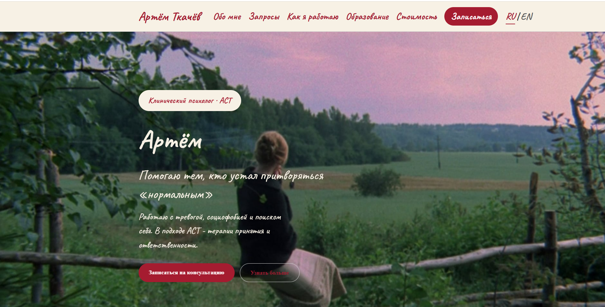
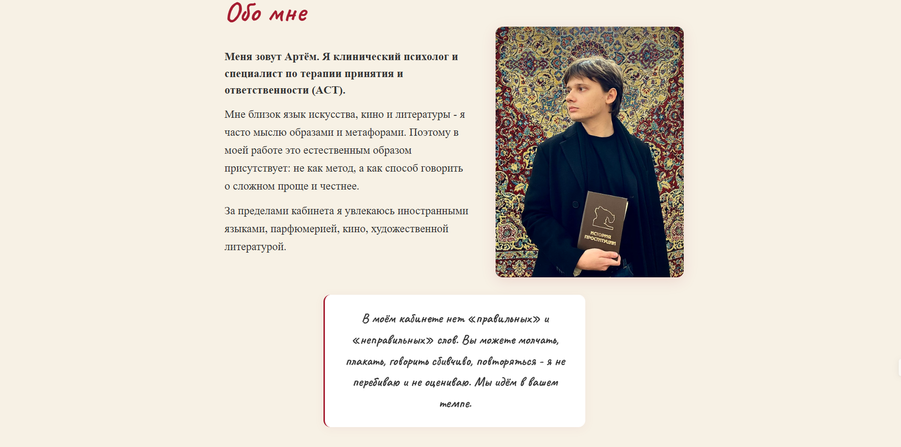
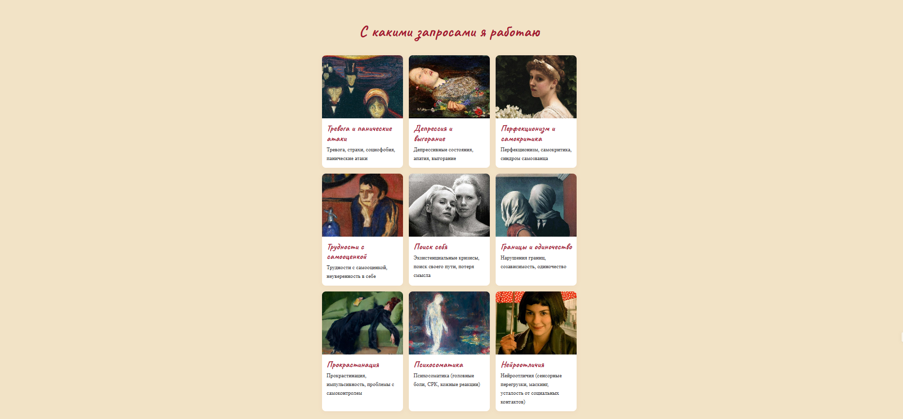
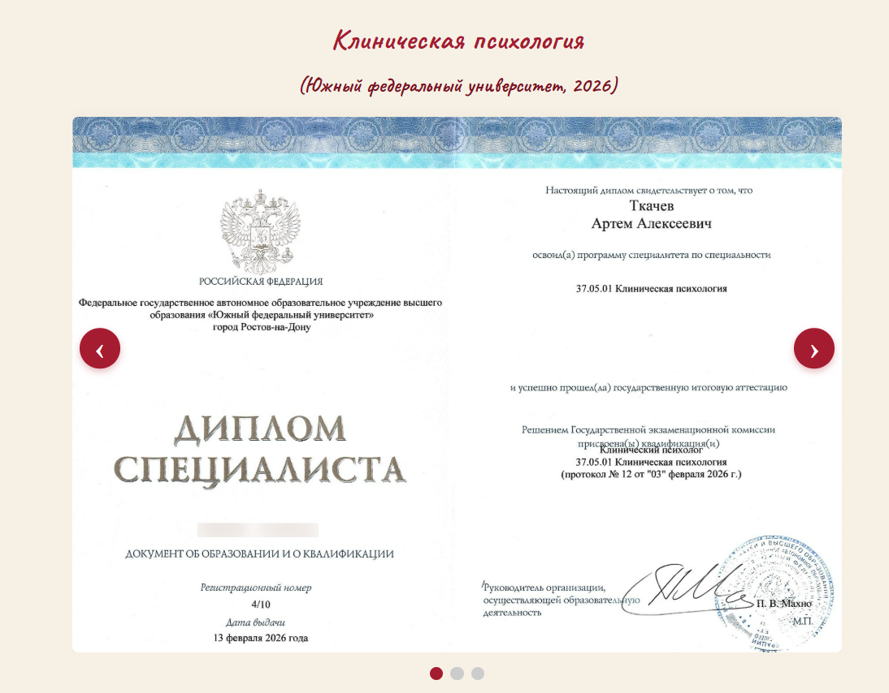
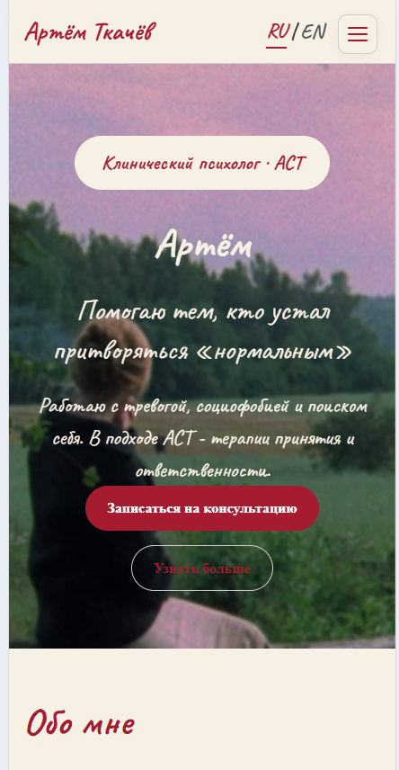
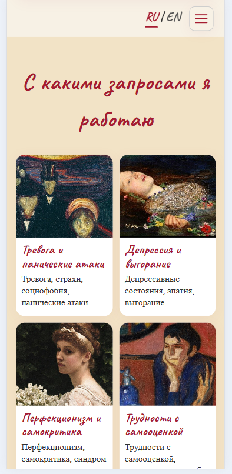

# 🧠 Artem Psychologist — Сайт клинического психолога

Персональный сайт-визитка для клинического психолога Артёма, работающего в подходе ACT (терапия принятия и ответственности). Проект создан с упором на эстетику, удобство использования и адаптивность под все устройства.

🌐 **Живой сайт:** [artflows.ru](https://artflows.ru)

---

## 🚀 Функционал

- 📌 Главная страница с презентацией специалиста
- 🧠 Блоки с запросами (тревога, депрессия, выгорание и др.)
- 📖 Раздел «Обо мне» с личной цитатой
- 🎓 Карусель с дипломами и сертификатами
- 💰 Блок стоимости услуг
- 📝 Форма обратной связи (интеграция с Google Forms)
- 📱 Адаптивная верстка (desktop / tablet / mobile)
- 🍔 Бургер-меню для мобильных устройств
- 🌍 Мультиязычность (RU / EN)

---

## 🛠️ Стек технологий

| Категория | Технологии |
|-----------|------------|
| **Backend** | Python 3.12, Flask |
| **Frontend** | HTML5, CSS3, JavaScript |
| **Формы** | Google Forms (embed) |
| **Шрифты** | Google Fonts (Caveat, Nunito) |
| **Деплой** | Beget (Passenger WSGI) |
| **SEO / Аналитика** | Яндекс.Вебмастер, Яндекс.Метрика, Яндекс.Бизнес |

---

## 📂 Структура проекта

```
psychologist/
├── app.py # Главный файл Flask (маршруты)
├── requirements.txt # Зависимости
├── passenger_wsgi.py # WSGI-конфигурация для Beget
├── .htaccess # Настройки Apache для Beget
├── static/
│ ├── css/
│ │ └── style.css # Стили (стиль «Амели»)
│ ├── images/ # Фото, дипломы, сертификаты
│ └── js/
│ └── main.js # Скрипты (бургер-меню, карусель)
└── templates/
├── index.html # Главная (RU)
├── index_en.html # Главная (EN)
├── privacy.html # Политика (RU)
└── privacy_en.html # Политика (EN)
```

---

## 🎨 Дизайн

Проект выполнен в стиле, вдохновлённом фильмом «Амели»:
- Рукописный шрифт **Caveat** для заголовков
- Пастельная палитра (кремовый, вишнёвый)
- Каждая карточка запроса проиллюстрирована картиной или кадром из кино

---

## 🌐 Демо

Сайт развернут и доступен по адресу: **[artflows.ru](https://artflows.ru)**

---

## 📸 Скриншоты

<p align="center">
  
  &nbsp;&nbsp;
  
</p>

<p align="center">
  
  &nbsp;&nbsp;
  
</p>

<p align="center">
  
  &nbsp;&nbsp;
  
</p>

---

## 💡 Особенности проекта

- Полный цикл разработки: от верстки до деплоя на хостинг
- Реализована мультиязычность без использования сторонних библиотек
- Форма обратной связи вынесена в Google Forms — это избавило от необходимости писать бэкенд для обработки заявок
- Настроены SEO-инструменты Яндекса для продвижения сайта
- Адаптивность проверена на iPhone, iPad Pro, iPad Air, десктопе

---

## ⚙️ Запуск проекта локально

```bash
git clone https://github.com/zvezda1207/Psychologist.git
cd Psychologist

python -m venv venv
venv\Scripts\activate          # Windows
# source venv/bin/activate     # macOS / Linux

pip install -r requirements.txt

python app.py
```

Сайт будет доступен по адресу: http://127.0.0.1:5000

---

## 🚀 Деплой

Проект развернут на хостинге Beget с использованием:

- Passenger WSGI
- Виртуального окружения Python
- Собственного домена artflows.ru

---

## 📌 Автор
Ирина Ткачёва — Junior Python Developer (Backend & Web Development)

- GitHub: @zvezda1207
- Email: ira.tka4eva2011@yandex.ru
- Telegram: @IrinaTka4eva

---

⭐ Если вам понравился проект — поставьте звезду репозиторию!